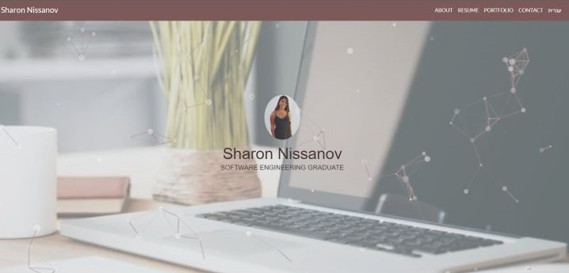

# **My Portfolio**
## Live preview: https://sharon-nissanov.com/

This is my responsive website that I have developed using: \
⚡️ ReactJS, EmailJS, ParticleJS, Semantic-UI and more. ⚡️ \
My website allows you to get to know me better. \
👍 You can read a bit about me and my skills. \
👍 You can take a look on projects that I have developed. \
👍 View My resume and even download it. \
👍 Contact me via mail, linkedin and phone. \
👍 Get all the information you need in English and Hebrew. 



### Setup & Run
- Clone or download this repository https://github.com/sharonNissanov/Portfolio 
- Install dependencies: in cmd run ```npm install``` 
- Run the app in the development mode: in cmd run ```npm start```\
Open [http://localhost:3000](http://localhost:3000) to view it in the browser.\
The page will reload if you make edits.\
You will also see any lint errors in the console. 

Enjoy 😊
